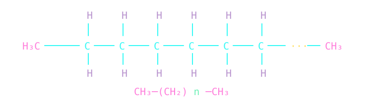

# Hi there, I'm Maciej 👋



Staff Engineer, 16+ years building software, leading architectural change, and helping engineering teams deliver reliable systems.

I design, modernize, and scale production web applications, working across architecture, platform evolution, engineering quality, and organizational boundaries to turn complex technical problems into maintainable systems that support long-term product growth.

## Core stack

```ts
type FullStackEngineer = {
  languages: string[];
  frameworks: string[];
  data: string[];
  platform: string[];
  sound: string[];
};

const me = {
  languages: ["TypeScript", "Bash", "Lua"],

  frameworks: ["React", "Next.js", "Node.js"],

  data: ["PostgreSQL", "MySQL", "Redis", "BigQuery"],

  platform: ["AWS", "GCP", "Docker", "Kubernetes", "Terraform"],

  sound: [
    `if, as a child, you hug a massive loudspeaker so you can feel the thump of its bass,
    you can assume that your fate has already been written`,
  ],
} satisfies FullStackEngineer;
```

## Outside the code

- `kerolox` is kerosene + liquid oxygen;
- [`RocketPropellant-1` nods to RP-1](https://en.wikipedia.org/wiki/RP-1);
- space nerd;
- vinyl collector;
- sound addict, it's all about `20Hz-250Hz`;
